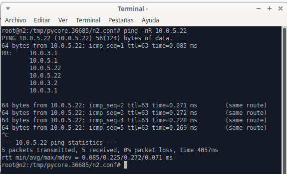

# Ejercicio 18

## Utilizando la herramienta CORE indicada por la cátedra, configurar el ruteo estático en la red que se muestra en el gráfico a continuación (fig. 2):

---

### Configuración de rutas por default en los routers

#### Configuración de Router "n2"

Sin ejecutar la topología, seleccionamos el router con click derecho y elegimos la opción "services..."
Para este caso dejamos marcadas las siguientes opciones

Ahora abrimos las configuraciones de "StaticRoute", donde debemos colocar las direcciones que tendrá la tabla de ruteo del router seleccionado. Además de deshabilitar la opción "rp_filter" como lo indica el enunciado.

Por útimo aplicamos los cambios y guardamos la topología para que no se pierdan los cambios al salir.

---

#### Verificación de tabla de ruteo

Ejecutamos la topología y una vez iniciada (todos los dispositivos deben mostrar el color verde), hacemos doble click sobre el router "n2" para abrir la terminal perteneciente a él. También es posible abrir la terminal haciendo click derecho -> Shell window -> bash.

Colocamos el comando `route -n`. Deberá aparecernos la ruta por default con la dirección IP de router "n3"

---

### Verificación de conectividad entre las PCs

En este caso hacemos el ejemplo entre las PCs "n9" y "n12"

---

#### Comando PING

Abrimos la terminal de la PC "n9" y colocamos `ping <ip_destino>`.

Para nuestro caso `ping 10.0.5.22`, ya que queremos comunicarnos con la PC "n12".

---

#### Comando TRACEROUTE

Abrimos la terminal de la PC "n9" y colocamos `traceroute <ip_destino>`.

Para nuestro caso `traceroute 10.0.5.22`, ya que queremos comunicarnos con la PC "n12".

---

#### Comando PING -NR

Abrimos la terminal de la PC "n9" y colocamos `ping -nR <ip_destino>`.

Para nuestro caso `ping -nR 10.0.5.22`, ya que queremos comunicarnos con la PC "n12".

---

#### Comando TRACEROUTE -I

Abrimos la terminal de la PC "n9" y colocamos `traceroute -I <ip_destino>`.

Para nuestro caso `traceroute -I 10.0.5.22`, ya que queremos comunicarnos con la PC "n12".

---

#### Comando MTR

Abrimos la terminal de la PC "n9" y colocamos `mtr <ip_destino>`.

Para nuestro caso `mtr 10.0.5.22`, ya que queremos comunicarnos con la PC "n12".

