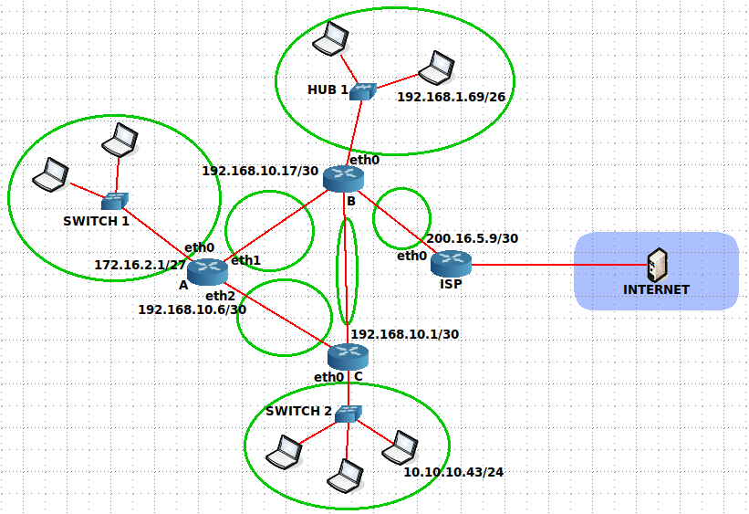

# Ejercicio 14

## Dado el siguiente gráfico, y según los datos brindados, para cada segmento de red, responda:

## Dirección y Clase (A,B o C) de Red. Dirección y Máscara de Subred. Dirección de Broadcast. Cantidad de direcciones utilizables en cada subred.

### 172.16.2.1/27

- Red de Clase B.
- Dirección de Red -> 172.16.0.0/16
- Dirección de Subred -> 172.16.2.0/27
- Máscara de Subred -> 255.255.255.224 ó /27
- Dirección de Broadcast -> 172.16.2.31/27
- Direcciones utilizables en cada subred -> $2^{5}$ - 2 = 30

---

### 192.168.10.6/30

- Red de Clase C.
- Dirección de Red -> 192.168.10.0/24
- Dirección de Subred -> 192.168.10.4/30
- Máscara de Subred -> 255.255.255.252 ó /30
- Dirección de Broadcast -> 192.168.10.7/30
- Direcciones utilizables en cada subred -> $2^{2}$ - 2 = 2

---

### 10.10.10.43/24

- Red de Clase A.
- Dirección de Red -> 10.0.0.0/8
- Dirección de Subred -> 10.10.10.0/24
- Máscara de Subred -> 255.255.255.0 ó /24
- Dirección de Broadcast -> 10.10.10.255/24
- Direcciones utilizables en cada subred -> $2^{8}$ - 2 = 254

---

### 192.168.10.1/30

- Red de Clase C.
- Dirección de Red -> 192.168.10.0/24 
- Dirección de Subred -> 192.168.10.0/30
- Máscara de Subred -> 255.255.255.252 ó /30
- Dirección de Broadcast -> 192.168.10.3/30
- Direcciones utilizables en cada subred -> $2^{2}$ - 2 = 2

---

### 200.16.5.9/30

- Red de Clase C.
- Dirección de Red -> 200.16.5.0/24
- Dirección de Subred -> 200.16.5.8/30
- Máscara de Subred -> 255.255.255.252 ó /30
- Dirección de Broadcast -> 200.16.5.11/30
- Direcciones utilizables en cada subred -> $2^{2}$ - 2 = 2

---

### 192.168.10.17/30

- Red de Clase C.
- Dirección de Red -> 192.168.10.0/24
- Dirección de Subred -> 192.168.10.16/30
- Máscara de Subred -> 255.255.255.252 ó /30
- Dirección de Broadcast -> 192.168.10.19/30
- Direcciones utilizables en cada subred -> $2^{2}$ - 2 = 2

---

### 192.168.1.69/26

- Red de Clase C.
- Dirección de Red -> 192.168.1.0/24
- Dirección de Subred -> 192.168.1.64/26
- Máscara de Subred -> 255.255.255.192 ó /26
- Dirección de Broadcast -> 192.168.1.127/26
- Direcciones utilizables en cada subred -> $2^{6}$ - 2 = 62

---

## ¿Cuántos dominios de colisión y de broadcast encuentra en el gráfico?.

### Dominios de colisión 

Se observan 12 dominios de colisión

### Dominios de broadcast

Se observan 7 dominios de broadcast

---

## Asigne una dirección adecuada a cada interfaz de red de los routers.

---

## Defina la tabla de ruteo para cada router de manera que todos los dispositivos en la red puedan comunicarse y, además, salir a Internet.

